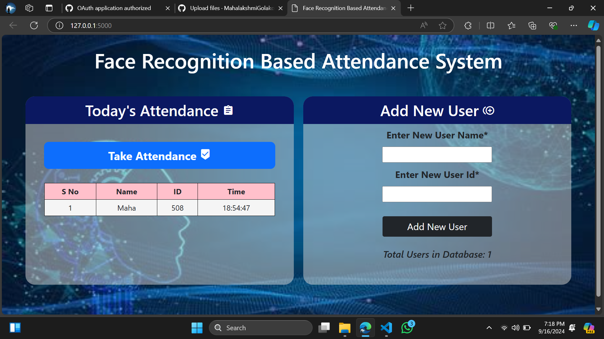

# Introduction
Every college require an attendance system to maintain record of present student
Face Recognition Attendance System is developed for the Faculty to maintain attendance record. 
It uses facial recognition technology to identify the person's facial features and automatically mark attendance which is very fast enough than previous method

# System Architecture

# Dataset Creation
Images of students are captured using a web cam. Multiple images of single student will be acquired with varied gestures and angles. These images undergo pre-processing. and stored in the dataset. Then these images will be converted from RGB to gray scale images. And then these images will be saved as the names of respective student

# Face Detection
Face detection here is performed using Haar-Cascade Classifier with OpenCV. Haar Cascade algorithm needs to be trained to detect human faces before it can be used for face detection. This is called feature extraction. This is required to create a rectangle around the faces in an image.

# Face Recognition 
Face recognition process can be divided into three steps- prepare training data, train face recognizer, prediction. Here training data will be the images present in the dataset. They will be assigned with a integer label of the student it belongs to. These images are then used for face recognition

# Attendance Updation

After face recognition process, the recognized faces will be marked as present in the excel sheet and stored it in folder.

# Face-Recognition-Based-Attendance-System  

